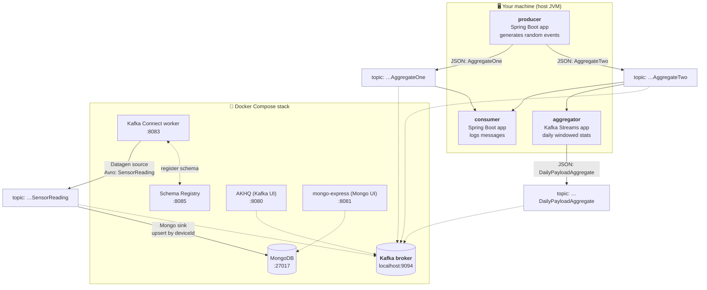
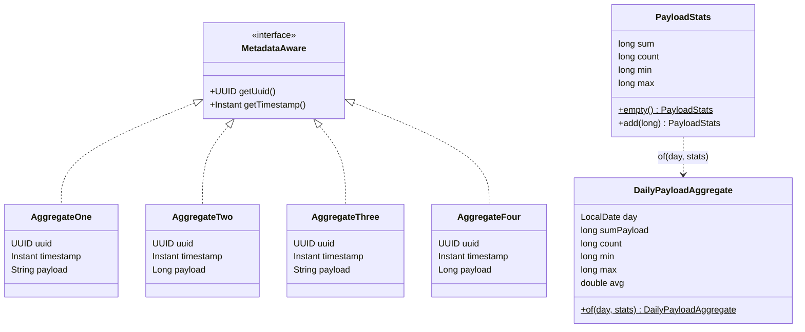
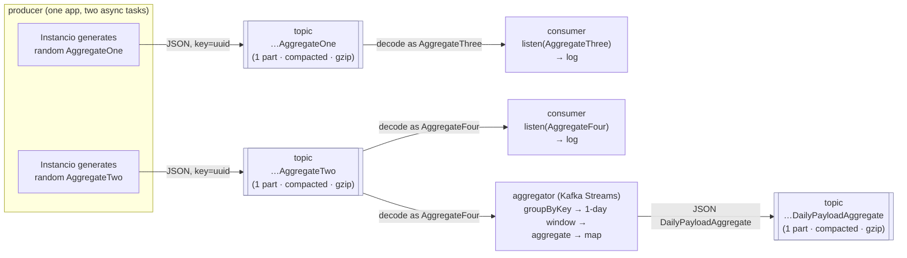
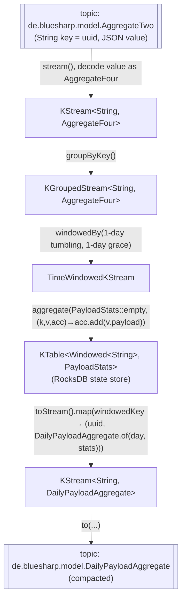
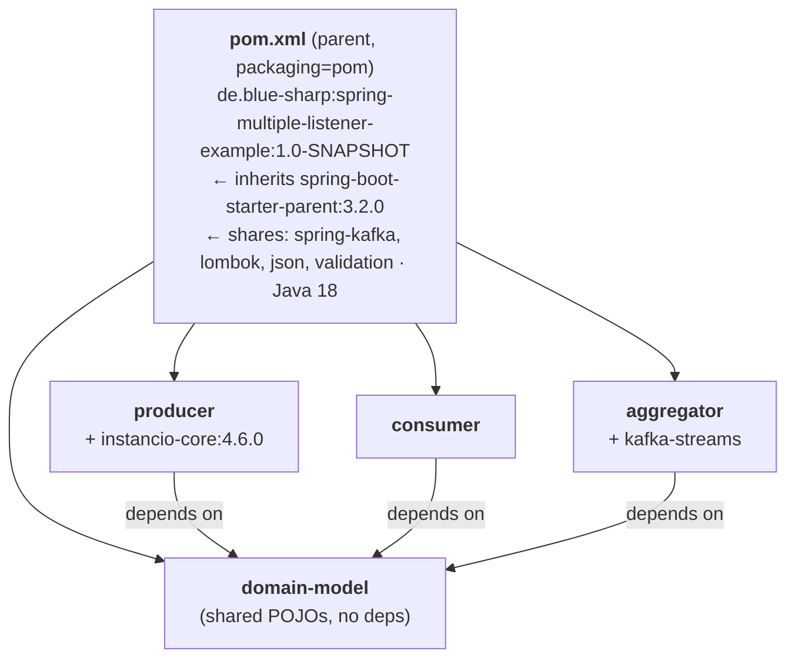
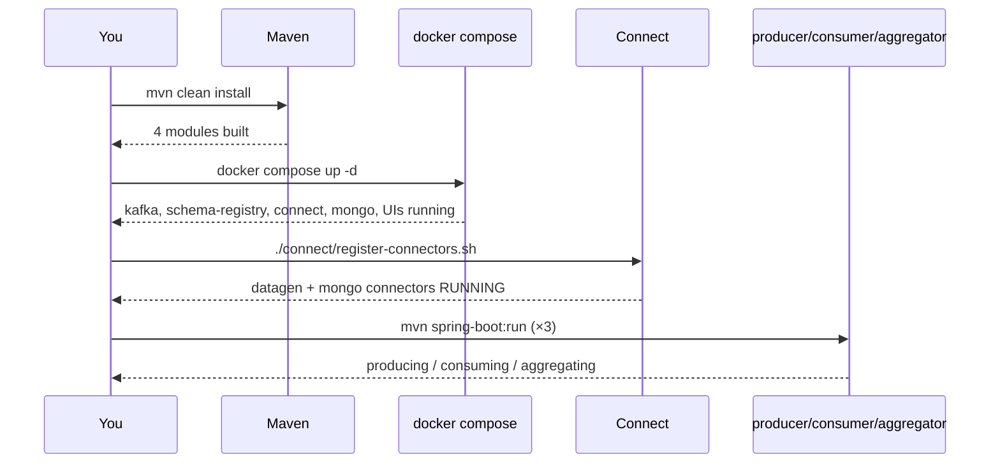

# spring-kafka-simple-json

> A hands-on, end-to-end **Apache Kafka playground** built with **Spring Boot 3** and
> **Kafka Connect**. It demonstrates, side by side, the two most common ways to move
> data through Kafka:
>
> 1. **Application code** — Spring Boot apps that *produce*, *consume*, and *stream-aggregate*
>    JSON messages (no schema registry, plain JSON on the wire).
> 2. **Kafka Connect** — a *zero-Java* pipeline that synthesizes Avro records and upserts
>    them into MongoDB, using the Confluent **Schema Registry**.
>
> This README explains the **complete architecture** from first principles. It is deliberately
> exhaustive but written to be readable if you have **never touched Kafka before**. Skim the
> [Table of Contents](#table-of-contents), or read top-to-bottom as a guided tour.

---

## Table of Contents

1. [What is this project? (the 60-second version)](#1-what-is-this-project-the-60-second-version)
2. [Kafka concepts in 5 minutes (skip if you know Kafka)](#2-kafka-concepts-in-5-minutes-skip-if-you-know-kafka)
3. [The big picture: one broker, two pipelines](#3-the-big-picture-one-broker-two-pipelines)
4. [Repository layout](#4-repository-layout)
5. [The domain model (the "nouns" of the system)](#5-the-domain-model-the-nouns-of-the-system)
6. [Pipeline A — the Spring/JSON pipeline](#6-pipeline-a--the-springjson-pipeline)
   - [6.1 Producer](#61-producer--where-data-is-born)
   - [6.2 Consumer](#62-consumer--the-structural-json-trick)
   - [6.3 Aggregator (Kafka Streams)](#63-aggregator--the-analytical-heart-kafka-streams)
7. [Pipeline B — the Kafka Connect / Avro / MongoDB pipeline](#7-pipeline-b--the-kafka-connect--avro--mongodb-pipeline)
8. [Serialization: JSON vs Avro, side by side](#8-serialization-json-vs-avro-side-by-side)
9. [Kafka topic catalog](#9-kafka-topic-catalog)
10. [Infrastructure (docker-compose)](#10-infrastructure-docker-compose)
11. [The build system (Maven multi-module)](#11-the-build-system-maven-multi-module)
12. [Running it end-to-end](#12-running-it-end-to-end)
13. [Observing the system](#13-observing-the-system)
14. [Configuration reference](#14-configuration-reference)
15. [Design decisions & FAQ](#15-design-decisions--faq)
16. [Glossary](#16-glossary)
17. [Troubleshooting](#17-troubleshooting)

---

## 1. What is this project? (the 60-second version)

At its core, this repo is a **learning lab**. It stands up a real Kafka cluster (plus a Schema
Registry, a Kafka Connect worker, and MongoDB) inside Docker, and then runs a handful of small
Spring Boot apps against it. Nothing here is a production system — every piece is chosen to make
one Kafka concept **visible and inspectable** in a web UI.

You will see two independent stories play out on the **same Kafka broker**:

| | Pipeline A — "Spring/JSON" | Pipeline B — "Connect/Avro" |
|---|---|---|
| **Written in** | Java (Spring Boot) | *No code* — JSON config only |
| **Data format on the wire** | Plain JSON | Avro + Schema Registry |
| **What it demonstrates** | Producing, consuming, and **stream aggregation** with Kafka Streams | Data generation & sinking with **Kafka Connect**, upserts into MongoDB |
| **Ends up in** | A `DailyPayloadAggregate` topic (an analytics result) | A MongoDB collection (`sensors.readings`) |

By the end of this document you'll understand every arrow in this diagram — and be able to run it
and watch data flow through it yourself.

---

## 2. Kafka concepts in 5 minutes (skip if you know Kafka)

If you already know Kafka, jump to [§3](#3-the-big-picture-one-broker-two-pipelines). Otherwise,
here is the minimum vocabulary you need. Everything below is a plain-English mental model, not a
formal definition.

- **Broker** — a Kafka *server*. It stores messages and serves them to clients. In this project
  there is exactly **one** broker (running in Docker).

- **Topic** — a named, append-only **log** of messages. Think "a durable message queue with a
  name," except messages aren't deleted when read — they sit in the log and *any* number of
  readers can read them independently. In this repo, topics are named after **Java class names**
  (e.g. `de.bluesharp.model.AggregateTwo`). That's a project convention, not a Kafka requirement.

- **Message / record** — a single entry in a topic. It has a **key**, a **value**, a
  **timestamp**, and lands in one **partition**. Here, keys are UUID strings and values are JSON
  (or Avro) objects.

- **Partition** — a topic is split into partitions so it can scale. Each partition is an ordered
  sequence; ordering is only guaranteed *within* a partition. Records with the same **key** always
  go to the same partition. (Most topics here use 1 partition to keep things simple and ordered.)

- **Offset** — a message's position number within its partition. Consumers remember "I've read up
  to offset N" so they can resume.

- **Producer** — a client that *writes* messages to a topic.

- **Consumer** — a client that *reads* messages from a topic.

- **Consumer group** — a set of consumers that share the work of reading a topic and *collectively*
  track their offsets. The group name is how Kafka remembers "how far has this application read?"

- **Log compaction** — an optional topic cleanup mode: instead of deleting old messages by age,
  Kafka keeps **only the latest message per key**. Great for "current state" topics. Several topics
  here are *compacted*.

- **Serialization / SerDe** — turning a Java object into bytes (**ser**ialize) and back
  (**de**serialize). A **SerDe** ("serializer + deserializer") is the pair. This project uses two
  strategies: **JSON** (Pipeline A) and **Avro** (Pipeline B).

- **Schema Registry** — a separate service that stores the *schema* (the shape) of Avro messages,
  so producers and consumers can agree on the format and evolve it safely. Only **Pipeline B** uses
  it.

- **Kafka Streams** — a Java **library** (not a separate server) for doing continuous computation
  *on top of* Kafka topics: filtering, grouping, windowing, aggregating, joining. The **aggregator**
  module is a Kafka Streams app.

- **Kafka Connect** — a *framework* for moving data in and out of Kafka **without writing code**.
  You configure ready-made **connectors** (a **source** connector pulls data *into* Kafka; a
  **sink** connector pushes data *out*). **Pipeline B** is built entirely from two connectors.

That's it. With those ten words you can read the rest of this document.

---

## 3. The big picture: one broker, two pipelines

Here is the entire system on one page. Solid arrows are data flow; the dashed boxes are the two
independent pipelines that happen to share the same Kafka broker.



**Read it like this:**

- **Pipeline A (the Java side):** the `producer` continuously invents random events and writes them
  as JSON to two topics. The `consumer` reads both topics and simply logs what it sees. In parallel,
  the `aggregator` reads one of those topics and rolls the numbers up into **daily statistics**,
  which it writes to a third topic.

- **Pipeline B (the no-code side):** a **Datagen** connector fabricates rich IoT `SensorReading`
  records (as **Avro**, registering their schema in the Schema Registry) onto a topic; a **MongoDB**
  connector reads that topic and **upserts** each record into MongoDB.

The two pipelines never touch each other's data — they only share the broker and the Docker stack.
That's intentional: it lets you compare **"do it with app code + JSON"** against
**"do it with Connect + Avro"** in one place.

---

## 4. Repository layout

```
spring-kafka-simple-json/
├── pom.xml                     ← Maven "reactor" (parent) — ties the 4 Java modules together
├── docker-compose.yml          ← the whole runtime: Kafka, Schema Registry, Connect, Mongo, UIs
│
├── domain-model/               ← 📦 shared library: the data classes ("nouns"). No Kafka code.
│   └── …/de/bluesharp/model/
│       ├── MetadataAware.java        (interface: uuid + timestamp)
│       ├── AggregateOne.java         (uuid, timestamp, String payload)
│       ├── AggregateTwo.java         (uuid, timestamp, Long   payload)
│       ├── AggregateThree.java       (twin of One — consumer-side only)
│       ├── AggregateFour.java        (twin of Two — consumer + aggregator)
│       ├── PayloadStats.java         (running accumulator: sum/count/min/max)
│       └── DailyPayloadAggregate.java(final analytics record: day + stats + avg)
│
├── producer/                   ← 🟢 Spring Boot app: generates & sends random JSON events
│   └── …/de/bluesharp/
│       ├── Producer.java
│       └── kafka/{KafkaConfiguration, KafkaAggregateOneTestDataProducer, KafkaAggregateTwoTestDataProducer}.java
│
├── consumer/                   ← 🔵 Spring Boot app: reads two topics, logs them
│   └── …/de/bluesharp/
│       ├── Consumer.java
│       ├── SimpleAggregateThreeConsumerService.java   (@KafkaListener methods)
│       └── kafka/KafkaConfiguration.java
│
├── aggregator/                 ← 🟣 Spring Boot + Kafka Streams: daily windowed aggregation
│   └── …/de/bluesharp/
│       ├── Aggregator.java
│       └── kafka/KafkaStreamsConfiguration.java        (the streaming topology)
│
└── connect/                    ← ⚙️ NOT a Java module — pure Kafka Connect config (Pipeline B)
    ├── README.md                     (deep dive on the Connect pipeline — worth reading)
    ├── schemas/sensor-reading.avsc   (the Avro schema, "source of truth")
    ├── datagen-sensor-source.json    (source connector config)
    ├── mongo-sensor-sink.json        (sink connector config)
    └── register-connectors.sh        (idempotent REST registration script)
```

Two things to notice up front:

1. **`domain-model` is shared.** All three apps depend on it, so they all speak the *same* Java
   types. (See the [dependency graph](#11-the-build-system-maven-multi-module).)
2. **`connect/` has no Java.** It's just JSON + a shell script. The whole Pipeline B lives in
   config and Docker images.

---

## 5. The domain model (the "nouns" of the system)

Everything in the Java pipeline is one of these seven types, all in package `de.bluesharp.model`
inside the `domain-model` module. They are deliberately tiny — most are a handful of fields — so
the *plumbing* stays the star of the show.



### `MetadataAware` — the envelope contract

```java
public interface MetadataAware {
    UUID getUuid();       // identity — "which thing is this?"
    Instant getTimestamp();  // event time — "when did it happen?"
}
```

This is the smallest possible contract for "an event that knows *what* it is and *when* it
happened." Those two properties are exactly what you need to **key** a stream (by `uuid`) and
**window** it (by `timestamp`). All four raw event classes implement it.

### `AggregateOne` … `AggregateFour` — four raw event types

Each is a plain Lombok `@Data` POJO (Lombok's `@Data` auto-generates getters, setters, `equals`,
`hashCode`, and `toString`). They differ **only** in the type of their `payload` field:

| Class | `payload` type | Who produces it | Who reads it |
|---|---|---|---|
| `AggregateOne` | `String` | `producer` | `consumer` (as `AggregateThree`) |
| `AggregateTwo` | `Long` | `producer` | `consumer` (as `AggregateFour`) **and** `aggregator` |
| `AggregateThree` | `String` | *nobody* | `consumer` — deserialization target for the `AggregateOne` topic |
| `AggregateFour` | `Long` | *nobody* | `consumer` **and** `aggregator` — deserialization target for the `AggregateTwo` topic |

> 💡 **The key insight** — `AggregateThree` is a *structural twin* of `AggregateOne` (same fields),
> and `AggregateFour` is a twin of `AggregateTwo`. They are never *produced*; they exist only so the
> consumer can prove a point: **because the messages are plain JSON with no embedded type
> information, any class with a matching shape can deserialize them.** More on this in
> [§6.2](#62-consumer--the-structural-json-trick).

### `PayloadStats` — the running accumulator

```java
public class PayloadStats {
    private long sum, count, min, max;

    public static PayloadStats empty() {          // starting point for a new group
        return new PayloadStats(0L, 0L, Long.MAX_VALUE, Long.MIN_VALUE);
    }
    public PayloadStats add(long payload) {        // fold one more value in
        sum += payload; count++;
        min = Math.min(min, payload);
        max = Math.max(max, payload);
        return this;
    }
}
```

This is a classic **fold/reduce accumulator**. `empty()` gives a neutral starting value (note the
clever `min`/`max` seeds: `Long.MAX_VALUE`/`Long.MIN_VALUE` so the *first* real value always wins the
comparison), and `add()` folds one more number into the running totals. The Kafka Streams
**aggregator** stores one `PayloadStats` per group in its state store and keeps calling `add()` as
records arrive.

### `DailyPayloadAggregate` — the final analytics record

```java
public class DailyPayloadAggregate {
    private LocalDate day;
    private long sumPayload, count, min, max;
    private double avg;

    public static DailyPayloadAggregate of(LocalDate day, PayloadStats s) {
        double avg = s.getCount() == 0 ? 0.0 : (double) s.getSum() / s.getCount();
        return new DailyPayloadAggregate(day, s.getSum(), s.getCount(), s.getMin(), s.getMax(), avg);
    }
}
```

This is the **output** of the whole streaming computation: for a given key and calendar day, "here
are the sum, count, min, max, and average of every payload we saw." It's derived from a
`PayloadStats` snapshot via `of(day, stats)`, which also computes the `avg` on the spot.

> **Accumulator vs. output** — `PayloadStats` is the *mutable, internal* state that lives in the
> stream's state store; `DailyPayloadAggregate` is the *immutable, published* result written to a
> topic for the outside world. Keeping them separate is a tidy pattern: the accumulator can be
> optimized for folding, the output for readability.

---

## 6. Pipeline A — the Spring/JSON pipeline

This is the pure-Java half. Three Spring Boot apps, all speaking **plain JSON** over Kafka, with
**no Schema Registry** involved. Here's the data flow:



### 6.1 Producer — where data is born

**Entry point:** `Producer.java` is a `@SpringBootApplication` with a `CommandLineRunner` that, on
startup, fires **both** data generators concurrently and waits on them:

```java
@Bean
CommandLineRunner commandLineRunner(KafkaAggregateOneTestDataProducer p1,
                                    KafkaAggregateTwoTestDataProducer p2) {
    return args -> {
        var c1 = CompletableFuture.runAsync(p1);   // AggregateOne generator
        var c2 = CompletableFuture.runAsync(p2);   // AggregateTwo generator
        CompletableFuture.allOf(c1, c2).join();     // block here (keeps the app alive)
    };
}
```

**The generators** use [Instancio](https://www.instancio.org/) — a library that fills objects with
random data — to invent an **unbounded stream** of events:

```java
// KafkaAggregateTwoTestDataProducer (the AggregateOne one is identical, with a String payload)
var model = Instancio.of(AggregateTwo.class)
        .generate(field(AggregateTwo::getTimestamp),
                  gen -> gen.temporal().instant()
                           .range(Instant.now().minus(1, DAYS), Instant.now()))  // random point in last 24h
        .toModel();

Instancio.stream(model)          // ← an INFINITE stream of random AggregateTwo objects
        .parallel()
        .forEach(i -> kafkaTemplate.send(
                AggregateTwo.class.getCanonicalName(),   // topic = "de.bluesharp.model.AggregateTwo"
                null,                                     // partition: let Kafka decide
                i.getTimestamp().toEpochMilli(),          // record timestamp = the event time
                i.getUuid().toString(),                   // key = the UUID (as String)
                i));                                      // value = the object (serialized as JSON)
```

Three details worth internalizing:

1. **Topics are named after class names.** `AggregateOne.class.getCanonicalName()` yields the string
   `"de.bluesharp.model.AggregateOne"`, and that *is* the topic name. `KafkaConfiguration` pre-creates
   both topics as **compacted, gzip-compressed, single-partition** topics via `TopicBuilder`.

2. **Timestamps are randomized across the last 24 hours.** Each record's Kafka timestamp is set to a
   random instant in the past day, *not* "now." This is deliberate — it lets the aggregator's daily
   windowing (and its grace period) do something interesting with out-of-order event times.

3. **The key is the per-event UUID.** Every event gets a fresh random UUID, so keys almost never
   repeat. (This has an important consequence for the aggregator — see [§6.3](#63-aggregator--the-analytical-heart-kafka-streams).)

**Serialization** (`producer/application.yaml`):

```yaml
spring:
  kafka:
    bootstrap-servers: PLAINTEXT://localhost:9094      # the broker's external listener
    producer:
      key-serializer: org.apache.kafka.common.serialization.StringSerializer
      value-serializer: org.springframework.kafka.support.serializer.JsonSerializer
      properties:
        spring.json.add.type.headers: false            # ← THE important line (see §6.2)
```

That `spring.json.add.type.headers: false` line disables the `__TypeId__` header that Spring Kafka
would normally attach (telling the consumer "this JSON is an `AggregateTwo`"). Turning it **off**
means the wire message is *just JSON*, with no Java type baked in — which is what enables the trick
in the next section.

> **Does the producer ever stop?** No. `Instancio.stream(...)` is an *infinite* stream, so the
> `forEach` runs until you kill the app. The producer is a firehose of random events, by design.

### 6.2 Consumer — the "structural JSON" trick

The consumer is intentionally trivial *in behavior* (it just logs), but it demonstrates the concept
the whole repo is named for. Two `@KafkaListener` methods:

```java
@Service @Slf4j
public class SimpleAggregateThreeConsumerService {

    @KafkaListener(topics = "de.bluesharp.model.AggregateOne")
    public void listen(AggregateThree aggregate) {   // ← reads AggregateOne topic AS AggregateThree
        log.info("{}", aggregate);
    }

    @KafkaListener(topics = "de.bluesharp.model.AggregateTwo")
    public void listen(AggregateFour aggregate) {    // ← reads AggregateTwo topic AS AggregateFour
        log.info("{}", aggregate);
    }
}
```

Look carefully: the producer wrote **`AggregateOne`** to the `AggregateOne` topic, but the consumer
deserializes it into **`AggregateThree`**. Likewise, `AggregateTwo` → `AggregateFour`. How is that
legal?

> **Because JSON carries no Java type.** With `add.type.headers: false` on the producer, the message
> is just `{"uuid":"…","timestamp":"…","payload":"…"}`. On the consumer side, a `JsonMessageConverter`
> bean binds that JSON to **whatever type the listener method declares** — and since `AggregateThree`
> has the exact same field shape as `AggregateOne`, the binding succeeds. Type identity is
> irrelevant; only **field compatibility** matters.

This is the pedagogical payoff of the whole "simple JSON" approach: producers and consumers are
decoupled down to the *shape* of the data, not the *class name*. (Contrast this with Avro in Pipeline
B, where the schema is explicit and registered.)

**Config** (`consumer/application.yaml`): consumer group `spring-consumer`, `auto-offset-reset:
earliest` (so on first run it reads each topic from the very beginning). Value binding is handled by
the `JsonMessageConverter` + the listener's parameter type, as described above.

The consumer is purely observational — it stores nothing and forwards nothing. It exists to make the
JSON messages *visible in the log* and to demonstrate the structural-binding trick. It is completely
independent of the aggregator (they both read the `AggregateTwo` topic, but do unrelated things).

### 6.3 Aggregator — the analytical heart (Kafka Streams)

This is the most substantial piece of code in the project. It's a **Kafka Streams** application:
instead of a simple "read a message, handle it" loop, it defines a **topology** — a dataflow graph
that Kafka Streams runs continuously, maintaining state as records flow through.

The goal: **for each key, roll every numeric payload up into per-day statistics.**



The full topology (`KafkaStreamsConfiguration.java`), annotated:

```java
public static final String INPUT_TOPIC  = "de.bluesharp.model.AggregateTwo";
public static final String OUTPUT_TOPIC = DailyPayloadAggregate.class.getCanonicalName();

@Bean
public KStream<String, AggregateFour> dailyAggregateStream(StreamsBuilder builder) {
    // JSON SerDes for each stage. ignoreTypeHeaders() mirrors the producer's "no type header" choice.
    JsonSerde<AggregateFour>        inputSerde  = new JsonSerde<>(AggregateFour.class).ignoreTypeHeaders();
    JsonSerde<PayloadStats>         statsSerde  = new JsonSerde<>(PayloadStats.class);
    JsonSerde<DailyPayloadAggregate> outputSerde = new JsonSerde<>(DailyPayloadAggregate.class);

    KStream<String, AggregateFour> stream =
            builder.stream(INPUT_TOPIC, Consumed.with(Serdes.String(), inputSerde));  // ① read AggregateTwo topic

    stream.groupByKey(Grouped.with(Serdes.String(), inputSerde))                       // ② group by the UUID key
          .windowedBy(TimeWindows.ofSizeAndGrace(Duration.ofDays(1), Duration.ofDays(1)))  // ③ 1-day windows + 1-day grace
          .aggregate(                                                                  // ④ fold payloads into PayloadStats
                  PayloadStats::empty,
                  (key, value, aggregate) -> aggregate.add(value.getPayload()),
                  Materialized.with(Serdes.String(), statsSerde))
          .toStream()                                                                  // ⑤ turn the result table back into a stream
          .map((windowedKey, stats) -> {                                              // ⑥ reshape into the output record
              String uuid = windowedKey.key();
              LocalDate day = windowedKey.window().startTime().atZone(ZoneOffset.UTC).toLocalDate();
              return KeyValue.pair(uuid, DailyPayloadAggregate.of(day, stats));
          })
          .to(OUTPUT_TOPIC, Produced.with(Serdes.String(), outputSerde));             // ⑦ write DailyPayloadAggregate

    return stream;
}
```

Walking the seven steps:

1. **Source** — read the `AggregateTwo` topic. Note the value is decoded as **`AggregateFour`** (the
   Long-payload twin) — the same structural-JSON trick as the consumer.
2. **Group by key** — group records by their existing key (the per-event UUID string).
3. **Window** — slice time into **1-day tumbling windows** with a **1-day grace period**. The grace
   period matters *specifically because* the producer emits timestamps randomly across the last 24
   hours: without grace, records whose event time is "earlier than the current stream time" would be
   dropped as *late*. A one-day grace keeps yesterday's window open long enough to accept them.
4. **Aggregate** — for each (key, window), start from `PayloadStats.empty()` and `add()` each
   payload. Kafka Streams persists this state in a **RocksDB-backed windowed state store** (and a
   changelog topic for fault tolerance), continuously updated as records land.
5. **To stream** — convert the resulting *table* of aggregates back into a *stream* of updates.
6. **Map / reshape** — extract the UUID and the window's calendar day (in UTC), and build the final
   `DailyPayloadAggregate.of(day, stats)`. The output is re-keyed by plain `uuid` (dropping the
   windowed-key wrapper).
7. **Sink** — write to the `DailyPayloadAggregate` topic (compacted, so only the latest aggregate per
   key survives long-term).

**Two configuration knobs make the behavior observable** (`aggregator/application.yaml`):

```yaml
spring:
  kafka:
    streams:
      application-id: spring-aggregator            # this app's consumer-group & state-store namespace
      properties:
        commit.interval.ms: 1000                   # flush/commit every second
        cache.max.bytes.buffering: 0               # ← emit EVERY update (no dedup buffering)
        spring.json.trusted.packages: "de.bluesharp.model"   # allow JSON→POJO for these classes
```

`cache.max.bytes.buffering: 0` disables the Streams record cache, so **every** change to an aggregate
is forwarded downstream immediately rather than being batched/deduped. That's why, watching the
output topic, you'll see the `DailyPayloadAggregate` for a key **refine over time** as more events
accumulate — a great way to *see* stream processing happen.

> ⚠️ **A subtle "gotcha" worth understanding:** the stream groups by the **per-event UUID**, and the
> producer gives every event a *unique* UUID. So in practice each group usually contains exactly one
> event, and each emitted `DailyPayloadAggregate` typically summarizes a single value (sum == min ==
> max == payload, count == 1, avg == payload). This is fine for a demo of the *mechanics*, but if you
> wanted meaningful daily aggregates you'd group by a **coarser key** (e.g. a fixed device id, or the
> day itself) so many events fall into the same group. It's a one-line change and a nice exercise.

---

## 7. Pipeline B — the Kafka Connect / Avro / MongoDB pipeline

Pipeline B contains **no Java code at all** — it's built entirely from two Kafka Connect connectors
configured with JSON. There's a dedicated, excellent write-up in
[`connect/README.md`](connect/README.md); this section summarizes it so this document is
self-contained.

```
┌──────────────────────┐   Avro value   ┌─────────────────────────┐   upsert by    ┌───────────────┐
│ Datagen Source        │  ───────────▶  │ topic:                  │   deviceId     │ MongoDB       │
│ Connector             │  String key    │ de.bluesharp.model.     │  ────────────▶ │ sensors       │
│ schema=SensorReading  │  (deviceId)    │ SensorReading           │  (Mongo Sink   │ .readings     │
│ keyfield=deviceId     │                │ (Schema Registry :8085) │   Connector)   │               │
└──────────────────────┘                └─────────────────────────┘                └───────────────┘
```

**The source — Datagen** (`connect/datagen-sensor-source.json`): the Confluent **Datagen** connector
is a *source* connector that fabricates fake records from an Avro schema. It reads
`schemas/sensor-reading.avsc`, uses `deviceId` as the message key, encodes values as **Avro**
(registering the schema in the Schema Registry at `:8085`), and writes to topic
`de.bluesharp.model.SensorReading` roughly once per second.

**The schema — `SensorReading`** (`connect/schemas/sensor-reading.avsc`): deliberately crafted to
exercise **every Avro type plus nesting**, so the resulting MongoDB document is rich:

| Field | Avro type | Note |
|---|---|---|
| `deviceId` | string (pool of 8) | business key; repeats drive the upsert |
| `version` | long | revision counter |
| `sensorType` | enum | `TEMPERATURE \| HUMIDITY \| PRESSURE \| MOTION` |
| `temperature`, `humidity` | double | ranged |
| `battery` | int | 0–100 |
| `online` | boolean | |
| `readAt` | long + `timestamp-millis` | stored as a BSON **Date** |
| `signalSample` | bytes | BSON binary |
| `tags` | array&lt;string&gt; | |
| `location` | nested record | lat/long/building/floor |
| `metrics` | array of record `Metric` | deep nesting (name/value/unit-enum) |
| `attributes` | map&lt;string,string&gt; | |

**The sink — MongoDB** (`connect/mongo-sensor-sink.json`): the MongoDB **sink** connector reads the
`SensorReading` topic and writes to database `sensors`, collection `readings`. The key design choice
is **upsert by business key**:

```
document.id.strategy = PartialValueStrategy over [deviceId]  →  _id = { deviceId }
writemodel.strategy  = ReplaceOneDefaultStrategy             →  replaceOne(_id, doc, upsert=true)
```

Because `deviceId` is drawn from a pool of only **8 values**, keys repeat constantly, and the upsert
**collapses the infinite stream down to ~8 documents** — one per device — each *overwritten*
(last-write-wins) as newer readings arrive. That's what makes the upsert behavior visible: the
collection stays small, and you watch `version` / `readAt` climb on each document.

> The `connect/README.md` also explains *why* there's no "higher version wins" gating (the shipped
> MongoDB write strategies are all plain last-write-wins; true version gating would require a custom
> `WriteModelStrategy` Java class, which would defeat the zero-Java goal). Read it for the full story.

**Registration** (`connect/register-connectors.sh`): an idempotent bash script that waits for the
Connect worker and its plugins to load, then `PUT`s each connector config to the Connect REST API
(`http://localhost:8083`). Re-running it just updates the connectors in place.

---

## 8. Serialization: JSON vs Avro, side by side

One of the most instructive things about this repo is that it runs **both** serialization strategies
at once. Here's the contrast:

| | **Pipeline A — JSON** | **Pipeline B — Avro** |
|---|---|---|
| Key serializer | `StringSerializer` | `StringConverter` |
| Value format | JSON (Jackson) | Avro (binary) |
| Schema Registry? | **No** | **Yes** (`schema-registry:8085`) |
| Where the "schema" lives | Implicitly, in the Java classes | Explicitly, in `sensor-reading.avsc` + registered |
| Type info on the wire | **None** (`add.type.headers: false`) | Schema ID references the registry |
| Consequence | Any shape-compatible class can decode it | Strict, evolvable, self-describing |
| Configured in | `application.yaml` + `JsonSerde`/`JsonMessageConverter` | connector JSON + Connect worker env |

**Takeaways for a beginner:**

- **JSON** is the *low-ceremony* option: no extra service, human-readable messages, flexible binding.
  The cost is that there's no enforced contract — a producer can change the shape and a consumer only
  finds out at runtime.
- **Avro + Schema Registry** is the *high-assurance* option: compact binary, a central schema with
  compatibility rules, self-describing messages. The cost is the extra moving part (the registry) and
  a build/tooling step to work with schemas.

Neither is "better" — they're different points on the simplicity ↔ safety curve, and this project
lets you feel both.

---

## 9. Kafka topic catalog

Every topic that flows through the system:

| Topic | Format | Partitions | Cleanup | Produced by | Consumed by |
|---|---|---|---|---|---|
| `de.bluesharp.model.AggregateOne` | JSON | 1 | compact | `producer` (`AggregateOne`) | `consumer` (as `AggregateThree`) |
| `de.bluesharp.model.AggregateTwo` | JSON | 1 | compact | `producer` (`AggregateTwo`) | `consumer` (as `AggregateFour`) **+** `aggregator` |
| `de.bluesharp.model.DailyPayloadAggregate` | JSON | 1 | compact | `aggregator` | *(nobody in this repo — it's the analytics output)* |
| `de.bluesharp.model.SensorReading` | Avro | 12 (broker default) | delete | Datagen source connector | MongoDB sink connector |

Plus the **internal / infrastructure** topics Kafka and its tools create automatically (you'll see
them in AKHQ; you don't manage them):

- **Kafka Streams internals** — `spring-aggregator-*` changelog and repartition topics that back the
  aggregator's windowed state store.
- **Kafka Connect internals** — `_connect-configs`, `_connect-offsets`, `_connect-status`.
- **Cluster internals** — `__consumer_offsets` (where consumer groups store progress) and `_schemas`
  (where the Schema Registry persists Avro schemas).

> Why do the application topics have **1 partition** but `SensorReading` has **12**? The three
> application topics are pre-created in code with `TopicBuilder…partitions(1)`. `SensorReading` is
> *auto-created* by the broker (which has `KAFKA_NUM_PARTITIONS: 12`) because no one declares it
> explicitly.

---

## 10. Infrastructure (docker-compose)

`docker-compose.yml` brings up the entire runtime. Everything the apps need is here; the three Spring
apps run on your **host** and connect to the broker's external listener at `localhost:9094`.

| Service | Image | Host port(s) | What it is / why it's here |
|---|---|---|---|
| **kafka** | `confluentinc/cp-kafka:7.6.1` | `9094` | The single Kafka broker. Two listeners: `INTERNAL` (`kafka:9092`, used *inside* Docker) and `EXTERNAL_SAME_HOST` (`localhost:9094`, used by your host apps). Auto-creates topics; 12 default partitions; gzip compression. |
| **zookeeper** | `confluentinc/cp-zookeeper:7.6.1` | *(none)* | Kafka's coordination service (this setup uses the classic ZooKeeper mode, not KRaft). |
| **schema-registry** | `confluentinc/cp-schema-registry:7.6.1` | `8085` | Stores Avro schemas for **Pipeline B**. Unused by the JSON pipeline. |
| **kafka-connect** | `confluentinc/cp-kafka-connect:7.6.1` | `8083` | The Connect worker that hosts Pipeline B's two connectors. On startup it installs the Datagen and MongoDB plugins from Confluent Hub. Mounts `./connect/schemas` → `/schemas`. |
| **mongodb** | `mongo:7` | `27017` | The sink database for Pipeline B (`sensors.readings`). |
| **mongo-express** | `mongo-express:1.0.2` | `8081` | Web UI for MongoDB — the Mongo equivalent of AKHQ. |
| **akhq** | `tchiotludo/akhq` | `8080` | Web UI for Kafka: browse topics, messages, consumer groups, schemas. Your main window into the system. |

A few noteworthy broker settings (from the `kafka` service env):

- `KAFKA_AUTO_CREATE_TOPICS_ENABLE: true` — topics spring into existence on first use (that's how
  `SensorReading` appears without being declared).
- `KAFKA_NUM_PARTITIONS: 12` — default partition count for auto-created topics.
- `KAFKA_ADVERTISED_LISTENERS: INTERNAL://kafka:9092, EXTERNAL_SAME_HOST://localhost:9094` — the split
  that lets *both* in-Docker services and host apps reach the broker. **This is why your Spring apps
  use `localhost:9094`.**

### The Java 11 / 17 connector-pinning story

You may notice the `kafka-connect` service pins specific plugin versions on startup:

```yaml
command:
  - bash
  - -c
  - |
    confluent-hub install --no-prompt confluentinc/kafka-connect-datagen:0.6.5   # ← pinned!
    confluent-hub install --no-prompt mongodb/kafka-connect-mongodb:3.0.1
    exec /etc/confluent/docker/run
```

The comment in the file explains why: the `cp-kafka-connect:7.6.1` image runs a **Java-11-era JVM**,
but newer Datagen releases (`0.7.x`) bundle **Java-17-compiled Avro libraries** that fail to load on
it. Pinning Datagen to **`0.6.5`** avoids the mismatch.

> **Don't confuse this with the Maven build.** The four Java modules all compile to **Java 18**
> (`maven.compiler.source/target = 18`). The 11-vs-17 issue is *only* about a Connect **plugin** vs.
> the Connect **worker's** JVM — a Docker concern, resolved purely by version pinning. The two are
> unrelated.

---

## 11. The build system (Maven multi-module)

The project is a single **Maven reactor** (a parent POM that builds several child modules together).



**Coordinates & structure:**

- **Parent:** `de.blue-sharp:spring-multiple-listener-example:1.0-SNAPSHOT`, `packaging=pom`.
  (The `artifactId` reflects this project's origin as a fork of a "multiple listener" example; the
  *directory* it lives in is `spring-kafka-simple-json`.)
- **Parent BOM:** `spring-boot-starter-parent:3.2.0`, which version-manages Spring Kafka, Kafka
  Streams, Jackson, Lombok, etc. Everything resolves from **Maven Central** — there is no Confluent
  Maven repo, because the Avro/registry/Mongo pieces live entirely in Docker, not in the Java build.
- **Shared dependencies** (declared once in the parent, inherited by every module):
  `spring-boot-starter`, `spring-boot-starter-json`, `spring-boot-starter-validation`,
  `spring-kafka`, `lombok` (provided).
- **Module-specific dependencies:** `producer` adds **Instancio** (test-data generation), `aggregator`
  adds **kafka-streams**, `consumer` adds nothing extra, and all three depend on **`domain-model`**.
- **Java:** every module compiles to **Java 18**.

**`domain-model` is the linchpin.** Extracting the `de.bluesharp.model` classes into their own module
means the producer, consumer, and aggregator all compile against the *exact same* types — the shared
"contract" of the system.

**Build command** (from the repo root):

```bash
mvn clean install     # or: mvn clean package
```

Maven resolves the dependency graph and builds `domain-model` **first** (because the other three
depend on it), then `producer`, `consumer`, `aggregator`. Each app module produces a runnable Spring
Boot fat-jar under `target/`.

---

## 12. Running it end-to-end

You need: **Docker** (with Compose), a **JDK 18+**, and **Maven**. For the connector registration
step you also need `curl` and `jq`.

```bash
# 0. From the project root:
cd spring-kafka-simple-json

# 1. Build all four Java modules.
mvn clean install

# 2. Bring up the whole runtime (Kafka, Schema Registry, Connect, Mongo, both UIs).
docker compose up -d
#    Give Kafka Connect a minute the FIRST time — it downloads its plugins from Confluent Hub.

# 3. Register Pipeline B's connectors (waits for Connect + plugins, then registers).
./connect/register-connectors.sh

# 4. Start the three Spring apps (each in its own terminal). They connect to localhost:9094.
mvn -pl producer   -am spring-boot:run
mvn -pl consumer   -am spring-boot:run
mvn -pl aggregator -am spring-boot:run
#    (Or run the built jars: java -jar producer/target/producer-1.0-SNAPSHOT.jar, etc.)
```



**Startup ordering notes:**

- The Docker stack must be up **before** the Spring apps (they need the broker at `localhost:9094`).
- Among the three apps, order doesn't really matter: the consumer uses `auto-offset-reset: earliest`
  and Kafka Streams also starts from the earliest offset, so late-started apps catch up from the
  beginning of each topic.
- Pipeline B (Connect) is fully independent — you can run it with or without the Spring apps.

---

## 13. Observing the system

The whole point is to *watch* data move. Two web UIs make that easy:

**AKHQ (Kafka UI) → <http://localhost:8080>**

- Browse topics `de.bluesharp.model.AggregateOne` / `AggregateTwo` and watch JSON messages stream in.
- Open `de.bluesharp.model.DailyPayloadAggregate` and watch the aggregator's output refine over time.
- Open `de.bluesharp.model.SensorReading` to see the Avro messages from Datagen.
- Inspect consumer groups (`spring-consumer`, `spring-aggregator`) and their lag.

**mongo-express (Mongo UI) → <http://localhost:8081>**

- Database `sensors`, collection `readings`. Expect **~8 documents** (one per `deviceId`), each with
  `version` / `readAt` advancing as upserts land.

**From the shell:**

```bash
# Count and peek at the MongoDB documents:
docker compose exec mongodb mongosh sensors --quiet \
  --eval 'db.readings.countDocuments()' \
  --eval 'db.readings.findOne()'

# The consumer app logs every AggregateThree / AggregateFour it reads — just watch its console.
```

---

## 14. Configuration reference

The knobs that actually change behavior, gathered in one place:

| Setting | Where | Effect |
|---|---|---|
| `spring.json.add.type.headers: false` | `producer/application.yaml` | Strips Java type info from JSON → enables structural cross-class binding. |
| `JsonMessageConverter` bean + listener param type | `consumer` | Binds JSON to whatever class the `@KafkaListener` method declares. |
| `JsonSerde<>(…).ignoreTypeHeaders()` | `aggregator` topology | Matches the producer's "no type header" choice on the streams input. |
| `spring.json.trusted.packages: de.bluesharp.model` | `aggregator/application.yaml` | Allows Jackson to deserialize into `de.bluesharp.model.*` (security allow-list). |
| `cache.max.bytes.buffering: 0` | `aggregator/application.yaml` | Emit every aggregate update immediately (no buffering) — makes streaming visible. |
| `commit.interval.ms: 1000` | `aggregator/application.yaml` | Commit/flush cadence (1s). |
| `TimeWindows.ofSizeAndGrace(1d, 1d)` | `KafkaStreamsConfiguration` | 1-day tumbling windows with 1-day grace for out-of-order events. |
| `auto-offset-reset: earliest` | `consumer/application.yaml` | On first run, read each topic from the beginning. |
| `KAFKA_ADVERTISED_LISTENERS … localhost:9094` | `docker-compose.yml` | Why host apps use `localhost:9094`. |
| `kafka-connect-datagen:0.6.5` (pinned) | `docker-compose.yml` | Avoids the Java-17-Avro-on-Java-11 plugin failure. |
| `document.id.strategy` / `writemodel.strategy` | `connect/mongo-sensor-sink.json` | Upsert-by-`deviceId`, last-write-wins. |

---

## 15. Design decisions & FAQ

**Why name topics after Java class canonical names?**
It's a convention that makes the wiring self-documenting: the topic `de.bluesharp.model.AggregateTwo`
obviously carries `AggregateTwo`-shaped data. It also means the code never hard-codes topic strings
in two places — `Class.getCanonicalName()` is the single source of truth.

**Why JSON *without* type headers, then decode into a differently-named class?**
To demonstrate that, with plain JSON, producer and consumer are coupled only by the **shape** of the
data, not the class name. It's a teaching device (and a real pattern when two teams own separate
codebases but agree on a JSON shape). See [§6.2](#62-consumer--the-structural-json-trick).

**Why are the topics compacted?**
Compacted topics keep only the **latest value per key**. For the aggregate output that's exactly
right — you want "the current daily aggregate for this key," not its whole history. For the raw event
topics it's more of a demo choice (and keeps the topics from growing unbounded).

**Why a 1-day grace period on a 1-day window?**
Because the producer stamps events with **random times across the last 24h**, records routinely
arrive "in the past" relative to stream time. Grace keeps the window open long enough to include them
instead of dropping them as late.

**Why does each `DailyPayloadAggregate` usually summarize just one event?**
Because the stream groups by the **per-event UUID**, and UUIDs are unique. See the gotcha box in
[§6.3](#63-aggregator--the-analytical-heart-kafka-streams) — grouping by a coarser key is the natural
next exercise.

**Why doesn't the MongoDB upsert respect the `version` field ("higher version wins")?**
The shipped MongoDB sink write strategies are all plain last-write-wins; true version gating needs a
custom `WriteModelStrategy` Java class, which would break the "zero Java" goal of Pipeline B. Full
explanation in [`connect/README.md`](connect/README.md).

**Is there a known rough edge?**
Minor: in `consumer/application.yaml`, the `key-deserializer` is nested one level too deep (under
`properties` and re-prefixed), so that particular line is effectively a no-op. It doesn't break
anything — String keys deserialize fine by default and values go through the `JsonMessageConverter` —
but it's worth tidying if you touch that file.

---

## 16. Glossary

| Term | Meaning in this project |
|---|---|
| **Aggregate (as in `AggregateOne`)** | Just the name of a demo event class — *not* a DDD "aggregate root." Think "sample record type." |
| **Aggregation (as in the aggregator)** | The Kafka Streams operation of folding many records into a running summary (`PayloadStats`). |
| **SerDe** | Serializer + Deserializer pair. |
| **Tumbling window** | Fixed-size, non-overlapping time buckets (here, one per calendar day). |
| **Grace period** | Extra time a window stays open to accept late/out-of-order records. |
| **State store** | Where Kafka Streams keeps aggregation state (RocksDB on disk + a changelog topic in Kafka). |
| **Upsert** | "Update if it exists, insert if it doesn't" — the MongoDB sink's write mode. |
| **Reactor** | A Maven parent POM that builds multiple modules together. |
| **Connector** | A configured Kafka Connect plugin instance (a *source* pulls in, a *sink* pushes out). |
| **Converter** | Kafka Connect's equivalent of a SerDe (`StringConverter`, `AvroConverter`). |

---

## 17. Troubleshooting

- **Spring app can't reach Kafka.** Make sure `docker compose up -d` is running and you're using
  `localhost:9094` (the external listener). Inside Docker, services use `kafka:9092` instead.
- **`register-connectors.sh` hangs on "Waiting for connector plugins to load…".** The first
  `docker compose up` downloads plugins from Confluent Hub — this needs outbound internet and can take
  a minute or two. Check `docker compose logs kafka-connect`.
- **A Connect task shows `FAILED` right after startup.** The registration script already handles this
  — it restarts a failed task once. If it persists, re-run `./connect/register-connectors.sh` (it's
  idempotent).
- **No documents in MongoDB.** Confirm the `datagen-sensor-source` connector is `RUNNING` (AKHQ →
  topic `de.bluesharp.model.SensorReading` should have messages) and that `mongo-sensor-sink` is
  `RUNNING` (check `curl localhost:8083/connectors/mongo-sensor-sink/status | jq`).
- **The `DailyPayloadAggregate` topic is empty.** The aggregator only reads `AggregateTwo` — make sure
  the `producer` app is running and has written to `de.bluesharp.model.AggregateTwo`.
- **Datagen plugin fails to load with a class-version error.** You changed the pinned Datagen version;
  keep it at `0.6.5` for the `7.6.1` worker (see [§10](#the-java-11--17-connector-pinning-story)).

---

### Further reading in this repo

- [`connect/README.md`](connect/README.md) — the definitive deep dive on Pipeline B (Datagen → Avro →
  MongoDB), including the upsert/version discussion.
- The four `application.yaml` files — the ground truth for every runtime setting.
- `aggregator/.../KafkaStreamsConfiguration.java` — the whole streaming topology in ~40 lines.
